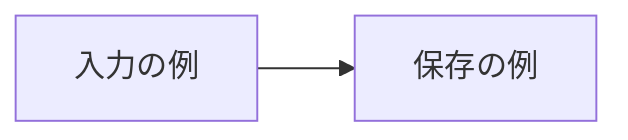

# コールアウトと図の例

## コールアウト
> [!note] 検証用の注記
> 著者が作ったコールアウトの例です。

## 折りたたみコールアウト
> [!tip]- 折りたたみの例
> 開いて表示を確認する内容です。

## 行内の数式
合成の数式例は $1+1=2$ です。

## 独立した数式
$$
x^2 + y^2 = 1
$$

## Mermaidの図

```mermaid
flowchart LR
 A[入力の例] --> B[保存の例]
```
