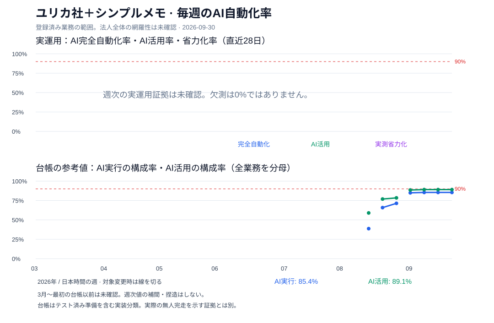

# ユリカ社＋シンプルメモの事業AI自動化率

2026-09-30の所有者指示に基づき、事業運営のどこまでをAIが担っているかを毎週追う。目標は**実運用のAI完全自動化率が90%を超え、その状態を維持すること**。判断品質の100点評価、コードのAI著者比率、CI成功率、設定済み予約数は代用品にしない。



## 現在確認できる位置

既存台帳の203項目を保持する。明示的な対象外11項目を除く**192業務を100%**として、人の業務と未実装も分母に残す。アプリ開発、法人経営、サポート、資金、マーケティング、プライバシー、事業継続を含む。ただし、ユリカ社の全事業を漏れなく列挙したことは未確認。法人全体の100%と言い切るには、その棚卸しが必要。

| 同じ全業務を分母にした指標 | 現在 | 意味 |
|---|---:|---|
| 台帳上のAI実行の構成率 | 164 / 192 = **85.4%（約8.5割）** | `ai_autonomous` と `ai_executes_gated` |
| 台帳上のAI活用の構成率 | 171 / 192 = **89.1%（約8.9割）** | 上記に提案・下書き7項目を加える |
| 実運用のAI完全自動化率 | **未測定** | 無人完走・全工程・全発生・介入観測の証拠が不足 |
| 実運用のAI活用率・実測省力化率 | **未測定** | 実際の利用・作業時間は台帳分類だけでは分からない |

台帳の `measured_at` は2026-09-15。main上の更新日時を新しい測定日と呼ばない。課金回復・返金検出・障害案内には、テスト済み準備と監視で計上し、本番初回は未観測という既存制約がある。85.4%を実際の完全自動化率とは認定しない。

旧4指標も保持する。総合自動化率85.4%、実施中180業務を分母にするAI実行率91.1%、同じ実施中分母のAI関与率95.0%、カバー率93.8%。**91.1%や95.0%を、全業務の完全自動化率90%達成とは扱わない。**

## 新しい主指標

0～100%で表示する。週は日本時間の月曜～日曜。毎週の観測は、その時点の直近28日を対象にする。窓は重なるので、4週継続は持続の確認であり、独立した4試行ではない。

| 指標 | 分子・計算 | 分母・条件 |
|---|---|---|
| **AI完全自動化率** | 起動／検知・判断・実行・検証・報告・学習をAIが担い、窓内の全発生を安全に完走した業務数 | 同じ全対象業務。手動起動、個別承認、修正、有人判断・検証が入れば完全自動には数えない |
| **AI活用率** | 実際にAIの提案・下書き・判断・実行を使った業務数 | 同じ全対象業務。人の判断・承認がある業務も活用には数えられる |
| **実測省力化率** | `max(0, min(1, 1 − 合計実測作業分数 / 合計基準作業分数))` | 比較可能な実測基準を着手前に固定。承認・確認・やり直しを含む。全業務の比較が揃わなければ全体率は未測定 |
| 観測充足 | 確認済み業務数／全対象業務数、未知の業務数 | 主指標と必ず併記。未知を0・成功へ置換しない |

機械のCI・予算・品質ゲートだけなら無人完走を妨げない。必要な人の承認は守り、その業務はAI活用・省力化として評価する。90%目標は承認を外す権限を与えない。

途中の1工程、緑のジョブ、空の介入配列、存在するスクリプトだけでは無人完走を証明しない。実際の起動元、窓内の全発生・失敗、人の活動を観測できた範囲、各工程、成果の確認を対応させる。希少イベントの未発生は `not_due` として分母に残し、テスト準備を本番完走へ読み替えない。

未確認が残れば点推定は `null`。確認できた完全自動の件数／全業務数を下限、未知が全部完全自動だった場合を上限として補助表示する。下限0は「確認できた件数0」であり、実運用0%の測定ではない。

## 既存項目を残し、新しい項目を足す

[`data/automation-coverage.json`](../../data/automation-coverage.json) の203項目、分類、証拠、対象外理由を保持する。IDは既存Company台帳と同じ領域・タスク名由来。分類変更でIDを変えず、改名・分割・統合は対応表と変更理由を残す。

新しく追う項目は**対象事業／責任者／頻度と期限／起動元／6工程の担い手／人の介入／本番成果／実測時間／証拠の期間・範囲**。既存164項目の実装実績を消さず、実装分類と実運用の証明を分ける。測定器を作るだけでは成功件数を増やさない。

追加候補は [`data/business-automation-policy.json`](../../data/business-automation-policy.json) に置く。

| 追加候補 | 対象確認・重複確認 |
|---|---|
| アプリ以外の受託・ライセンス等の受注～納品・検収 | 実際の事業有無。既存の営業、契約・請求・納品との境界 |
| AI事業者以外も含む定期契約の更新・解約と実処理 | 契約一覧と期限。既存の事業者審査・会計業務との境界 |
| 法人全事業の事業別損益と、継続・資金配分の判断 | アプリのCAC/LTV、AI原価、資金繰りとの重複を除いた法人全体の範囲 |

候補は確認待ちで、成功件数にも確定分母にもまだ加えない。候補が未確定なので法人全体の網羅性も未確認。対象を確定した週から分母へ含め、過去へ遡及しない。人の仕事を対象外へ移すだけの率上昇は運用改善に数えない。対象変更時は線を切り、固定対象での業務移管と、対象変更による差を分ける。

| 既存13領域 | 台帳AI実行／全対象業務 |
|---|---:|
| 次期機能開発 | 17 / 20 |
| バグ修正 | 19 / 19 |
| マーケティング | 26 / 32 |
| 本番デプロイ | 15 / 18 |
| AI予算・トークン | 15 / 17 |
| アプリ運営の意思決定 | 12 / 14 |
| 法人経営 | 10 / 14 |
| サポート | 9 / 9 |
| マネタイズ | 6 / 9 |
| AgentOps | 13 / 13 |
| データ・プライバシー | 9 / 11 |
| 事業継続 | 9 / 9 |
| アナログ領域 | 4 / 7 |

領域ごとの粒度は揃っていない。件数85.4%は、売上・労働時間・法人価値の85.4%ではない。時間の重みを使った省力化を別に測り、数字のためにタスクを細分化しない。

## 2026年3月からの週次履歴

[`data/business-automation-weekly.json`](../../data/business-automation-weekly.json) に2026-03-02から31週を並べる。最初の台帳はmainの2026-08-22の更新。各週末時点のmainの台帳、そのコミット、測定日、分子・分母、対象変更と据え置きを記録する。今週は途中の週として表示する。

| 週開始 | 台帳AI実行構成率 | 台帳AI活用構成率 | 全対象数 |
|---|---:|---:|---:|
| 3/2～8/10 | 未確認 | 未確認 | 未確認 |
| 8/17 | 38.7% | 59.0% | 173 |
| 8/24 | 65.8% | 76.9% | 199 |
| 8/31 | 71.4% | 78.4% | 199 |
| 9/7 | 84.9% | 88.5% | 192 |
| 9/14 | 85.4% | 89.1% | 192 |
| 9/21 | 85.4% | 89.1% | 192 |
| 9/28（9/30時点） | 85.4% | 89.1% | 192 |

これは**週次実運用の測定ではなく、週末時点の台帳分類の履歴**。同じ台帳の持越しを新しい測定と呼ばない。分母・対象変更も含むので、単純な能力向上の傾きとして読まない。

旧 [`data/autonomy-timeline.json`](../../data/autonomy-timeline.json) の月次再構成は別系列として残す。証拠ファイルの初出月から近似した3月8.3%などを、当時の実測や各週の値へ変換しない。過去のClaudeの私的会話でAI活用率という用語は確認できたが、当時の複数スコアの完全な原票と毎週の実測値は回収できていない。公開リポジトリに残る旧4指標を比較可能な基準にする。私的な会話原文は公開しない。

## 90%超を維持する運転

現在の192業務を固定すれば、実装分類だけでも173件が必要で、164件から**あと9件**。実運用の未測定、法人全体の追加対象、既存の有人工程が見つかれば必要な移管量は変わる。

1. 既存自動化の起動～成果と人の介入を確認し、法人全体の業務一覧を確かめる。
2. 提案止まり・未実装・有人の28項目から、人の手間と事業価値が大きく、現在の権限内で移管できる仕事を既存の日次主系が選ぶ。例は仕訳・請求・月次締め、CAC/LTV/粗利の統合、本番改善の完走と効果観測。接続・資料・権限が足りなければ不足を記録する。
3. 実行、読み戻し、成果の検証を終えてから実運用証拠へ追加する。正式審査の拒否や秘密の不明を迂回しない。新認証、価格・契約・支払い・公開等は既存の承認境界を守る。
4. 毎週、同じ対象業務で完全自動化率が**90%より大きい**かを確認。未知・失敗・人の作業時間・費用・対象変更を併記する。90.0%ちょうどは達成ではない。4週連続で全業務の測定と法人対象確認が揃えば維持状態とし、下がった／欠測した週は維持未確認へ戻す。

定義・計算元・依存と変更理由は [`data/kpi-definitions.json`](../../data/kpi-definitions.json) にも登録する。旧スコアの式と履歴を維持し、新しい3割合は別の定義IDで追う。

率は運転状況を示す計器で、作業選択の報酬ではない。目的と方法の判断品質は [補助の100点評価](OUTCOME_AUTONOMY_SCORE.md) に分ける。

## 既存の運転への接続と証拠

既存の日次主系 `obsidian` と、既存の週次Company報告を利用する。予約・通知・AI呼出し・遠隔収集を増やさない。レビュー済みmainに入った後、既存の `review --cadence weekly` が集計とグラフを私的に保持する。**ドラフトPRの段階では自然な予約実行への反映や90%達成を証明していない。** この作業でmerge・deploy・Cloudflare設定変更・新認証は行わない。

```sh
node scripts/business-automation.mjs --json
node scripts/company-os.mjs autonomy-status
node scripts/company-os.mjs review --cadence weekly
node scripts/business-automation.mjs --selftest
node scripts/business-automation.mjs --check
# 私的週次履歴から公開用の集計JSON・図をローカルに用意。送信・commitはしない。
node scripts/business-automation.mjs --export-weekly
```

実運用入力は既存の私的Company状態領域の `data/business-automation-observations.json`。Git外の所有者専用0600のみ受け付ける。集計・グラフは `business-automation/weekly.json` と `weekly.svg` に私的に残す。秘密値・秘密値のハッシュは入力にも入れない。CLI・図には顧客、証拠本文、私的パスや参照IDを出さない。

入力は `schema_version:1`, `window:{from,through}`, `review:{kind:"human",at,evidence_ref}`, `scope:{company_wide_complete,evidence_ref}`, `tasks`。各行は既存Company IDと `unknown` / `not_due` / `unimplemented` / `human_only` / `observed` を持つ。

`observed` には窓が一致する `source_window`、全発生・人の活動の観測範囲と参照、`last_occurrence_at`、発生数、起動元、AI使用、介入数、全発生の成功、安全確認、6工程の担い手が必要。省力化には着手前の実測基準と実際の時間・各参照が必要。自己レビュー、古い／未来の観測、重複・未知ID、対象外行の加点を拒否する。

レビュー原本は人が確認する。**human宣言だけでレビュアー本人や観測の網羅性を計算器が独立証明することはできない。** 週次計算の自動化と、全業務の実績収集の自動化は別で、後者の完全な収集・原本対応は今後の運用課題。必要な観測が欠ければ未測定を保つ。

公開時は私的報告をそのままGitへ送らず、集計の根拠・外部名義・画像・メタデータを最終確認する。取り消しは通常のrevert PRで追加分を戻し、既存203項目と旧系列を保持する。

`--export-weekly` は許可した集計項目だけを取り出し、私的参照や追記文字列を転記しない。既に公開した実測点は保持し、欠測で消したり台帳値で補ったりしない。公開用チェックが確認するのは、台帳履歴の出典・集計の算数・対象一致・図との一致まで。実運用原本の独立監査や自然な予約実行の証明ではない。実測履歴が入った後の `--rebuild` は上書きを拒否し、履歴を保持するexport経路を使う。

実運用の観測には、その観測時点の対象数・対象ID集合の非秘密ダイジェスト・台帳集計を別保存する。同じ週の後半に台帳対象が変わっても、以前の実運用点を新しい分母へ読み替えない。台帳線は台帳の対象変更で、実運用線は実運用観測自身の対象変更で切る。
