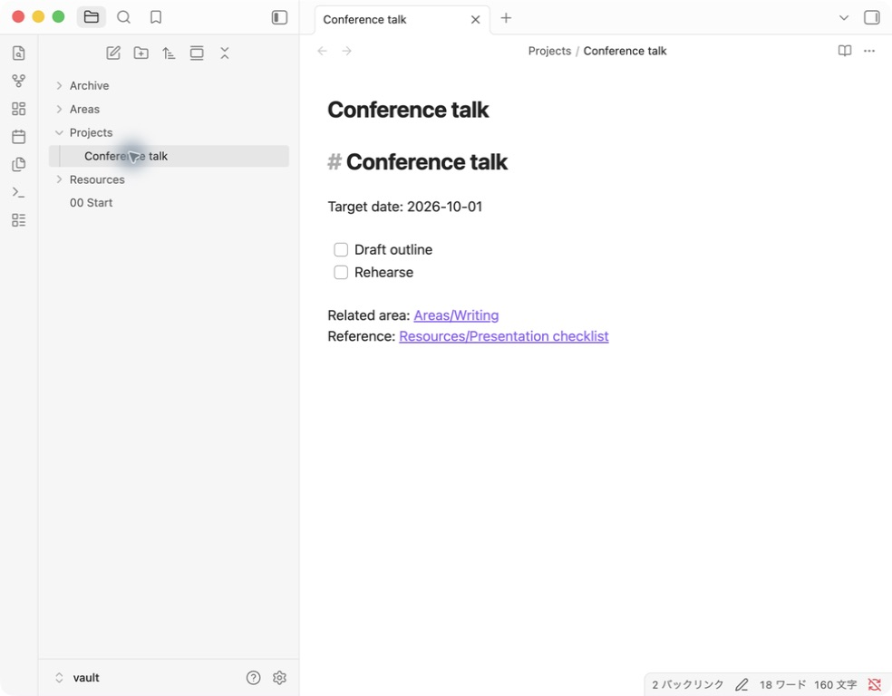
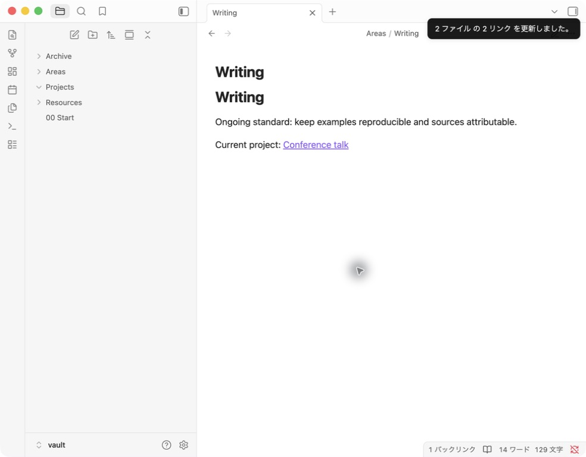

# Obsidianでセカンドブレインを作る — PARAの4フォルダとリンクの実装例

メモは増えたのに、次の作業で使う資料が見つからない。そんなときは、Obsidianの保管庫に「いま進めていること」と「あとで参照すること」の置き場を作ってみましょう。

この記事では、発表の準備を例に、4つのフォルダ、作業用ノート、関連資料へのリンクを用意します。最初に作るのは小さな一組だけです。すでにあるノートを一度に分類し直す必要はありません。

操作例は2026年9月15日、Mac版Obsidian 1.13.7の検証用保管庫で確認しました。画面の予定や文章は架空のサンプルです。フォルダ、チェック項目、内部リンク、Archiveへの移動を実際に操作しています。

## セカンドブレイン・CODE・PARAの役割

セカンドブレインは、あとで使う情報を自分の外に残し、仕事や学習で取り出すための考え方です。Tiago ForteのCODEは、Capture（集める）、Organize（整理する）、Distill（要点を取り出す）、Express（形にする）の流れを示します。[Forte Labsの解説](https://fortelabs.com/blog/basboverview/)

PARAは情報の置き場を4種類に分ける方法です。Projectsは目標のある進行中の活動、Areasは継続して面倒を見る責任領域、Resourcesは関心のある資料、Archivesは現在は使っていない項目を置く場所です。[PARAの原著者による説明](https://fortelabs.com/blog/para/)

ここではこの考え方を、Obsidianのフォルダとノートで試します。CODE全体を自動化する設定ではありません。考え方やメモの入口から見直したい場合は、[セカンドブレインの作り方](https://simplememofast.com/methods/second-brain/)も参照してください。

## 1. 保管庫に4つのフォルダを作る

試しに作る場合は、練習用の保管庫を用意すると元のノートに影響しません。初めて使う場合は[Obsidianの始め方](https://simplememofast.com/obsidian/getting-started/)から進められます。

ファイル一覧で新しいフォルダを作り、次の名前を付けます。今回の実画面に合わせ、Archivesに相当するフォルダ名は単数形の`Archive`を使います。

| フォルダ | 今回入れるもの | 迷ったときの判断 |
|---|---|---|
| Projects | 発表の準備ノート | 完了したと判断できる目標があるか |
| Areas | 文章を書くときに保ちたい基準 | 特定の発表が終わっても続けることか |
| Resources | 発表前に読むチェックリスト | 必要な場面で参照する資料か |
| Archive | 現在は取り組まないノート | 手元には残すが、進行中の一覧から外したいか |

たとえば「文章を書く」は続いていく活動ですが、「10月1日の発表原稿を仕上げる」には区切りがあります。前者の基準はAreasに、後者の作業はProjectsに置くと、次に開くノートを選びやすくなります。これは分類の一例なので、用途が違えば置き場を変えて構いません。

## 2. 発表用ノートに目標と次の作業を書く

`Projects`の中に`Conference talk`というノートを作ります。実画面と対応させるため名前は英語ですが、自分の保管庫では日本語でも構いません。

```markdown
# Conference talk

Target date: 2026-10-01

- [ ] Draft outline
- [ ] Rehearse

Related area: [[Areas/Writing]]
Reference: [[Resources/Presentation checklist]]
```

`Draft outline`は構成案を作る作業、`Rehearse`は発表の練習です。自分の例に置き換えるときは、「準備する」のような広い言葉より、次に手を動かせる大きさで書いてみてください。



*検証用保管庫の実画面。日付はサンプルの目標日で、実際の発表予定ではありません。*

チェック欄は読み取りビューなどでクリックできます。今回、構成案の欄をチェックすると、Markdownは`- [x] Draft outline`になり、ノートを開き直しても状態が残りました。練習の欄は未チェックのままです。フォルダを分けるだけでなく、ノートを開いたときに次の作業が見える形にします。

## 3. 基準と資料はリンクでつなぐ

次に`Areas/Writing`と`Resources/Presentation checklist`を作ります。前者には文章を書く際の基準、後者には発表前に確認する内容を入れます。以下は手動で使う記入例です。

```markdown
# Writing

Ongoing standard: keep examples reproducible and sources attributable.

Current project: [[Projects/Conference talk]]
```

この基準は「例を再現できるようにし、出典をたどれるようにする」という意味です。発表が変わっても使う基準として置いています。

発表用ノートの`[[Areas/Writing]]`から、この基準へ移動できます。資料の本文を毎回コピーする代わりに、必要なときに開くリンクを置きます。今回の検証でも、発表ノートからWritingへ移動し、戻りのリンクを開けることを確認しました。

Obsidianは`[[ノート名]]`の形式で内部リンクを作れます。同名ノートが複数ある場合は、フォルダを含む候補を選び、意図したノートが開くか確認してください。[内部リンクの公式説明](https://obsidian.md/help/links)

## 4. 使う場面で要点を取り出す

資料を置いたら、実際の作業で一度使ってみます。発表なら、チェックリストを開いて「今回の構成案で直す点」を発表用ノートへ短く書きます。

たとえば、次のような記入が考えられます。

```markdown
## 今回使う要点
- 冒頭で、聞き手に持ち帰ってほしい問いを一つ示す。
- 操作例には、その結果を確認できる画面を添える。

## 次の作業
- [ ] 導入の段落を3文で書く。
```

これは本文用に作った提案で、実画面に写る操作結果ではありません。資料を集めたあと、要点を選び、自分の原稿へ使う流れの例です。CODEのDistillとExpressを意識するときも、まずは「資料から一つ選び、いま作っているものに使う」小さな作業から始められます。

## 5. Archiveへ移し、リンクを開き直す

終わった作業や、いったん取り組まない作業は、進行中の一覧から外せます。Obsidian内で対象ノートのメニューを開き、移動コマンドから`Archive`を選びます。操作名や表示位置は言語・バージョンにより異なる場合があります。[ノート管理の公式説明](https://obsidian.md/help/manage-notes)

今回の移動では「2ファイル内の2リンク」を更新する確認が出たため、その回の更新を選びました。常時自動更新の設定は変更していません。



*移動直後の実画面。更新されたリンクからArchive内の発表ノートを開き直し、チェック状態も確認しました。*

移動後は次の3点を確認します。

1. 発表ノートがArchiveにあり、Projectsの元の場所から移動している。
2. Writingや資料側から、移動した発表ノートを開ける。
3. ノートの本文やチェック状態が残っている。

画面例では移動動作を試しただけで、発表が完了したわけではありません。チェック欄が残っていても移動はできるため、「移動できた」と「作業が終わった」は自分で分けて判断します。

## 運用を始めたら、何を見返す？

まずは一つのプロジェクトで使い、作業を始めるときにProjectsを開いてみてください。次の行動が分からなければ、ノートの末尾に一つ書き足します。資料へのリンクが増えすぎたら、今回使うものだけを本文の近くに置きます。

週末など自分で決めたタイミングで、終わったもの、保留するもの、次も使う資料を見直す方法もあります。これは運用の提案で、決まった見直し頻度による効果を測った結果ではありません。

日々の記録を先に残しておきたい場合は、[Obsidianでジャーナリング](https://simplememofast.com/obsidian/journaling/)の手動ひな形も使えます。外出先で残すメモと、机で整理するノートを分けたいときは、[メモの入口からObsidianへつなぐ考え方](https://simplememofast.com/methods/second-brain/)を参照してください。

## よくある質問

### プラグインは必要ですか？

この記事のフォルダ・チェック項目・内部リンク・移動の例では、コミュニティプラグインを追加していません。自動分類や外部サービスとの同期は扱っていません。

### 既存のメモを全部PARAに移す必要はありますか？

この手順では、一つの練習用プロジェクトから始められます。既存ノートを移す場合は、バックアップを用意し、少数で移動とリンクの動きを確認してから進めてください。

### ProjectsとResourcesのどちらに置くか迷います。

いま進める発表の原稿ならProjects、ほかの発表にも使う一般的な資料ならResources、という分け方ができます。原稿側から資料へリンクすれば、同じ本文を両方へコピーせず参照できます。

### グラフを作ればセカンドブレインは完成しますか？

リンクの表示だけでは、資料を必要な場面で使えるかは分かりません。まずは作業ノートから資料へ進み、要点を一つ原稿へ戻せるか試してみてください。今回の操作確認から、記憶力や生産性の向上は判断していません。

## 参考資料と確認範囲

- [Forte Labs — Building a Second Brain](https://fortelabs.com/blog/basboverview/)
- [Forte Labs — PARA](https://fortelabs.com/blog/para/)
- [Obsidian — Internal links](https://obsidian.md/help/links)
- [Obsidian — Manage notes](https://obsidian.md/help/manage-notes)

資料確認日：2026年9月15日。実操作の範囲はMac版Obsidian 1.13.7の検証用保管庫です。CODEの長期運用、プラグイン、自動配送、複数端末の同期、生産性への効果は今回の検証に含みません。
